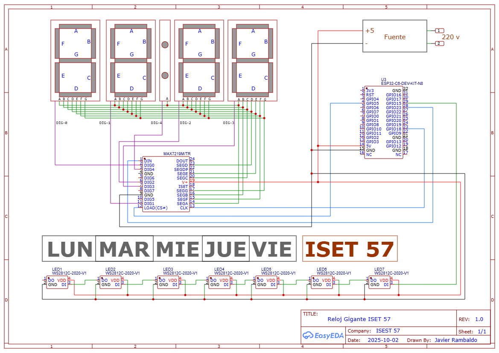

# Reloj Gigante con Max7219

## Circuito

## Funcionamiento

- Utiliza un Max7219 para manejar los 4 displays de 7 segmentos
- Los días de semana y el nombre ISET 57 están comandados por leds RGB WS2812
- Un ESP32 se conecta a internet para mantener la hora exacta.

## Problemas actuales

- Si se corta la luz se pierde la hora! Faltaría poner un RTC con batería.
